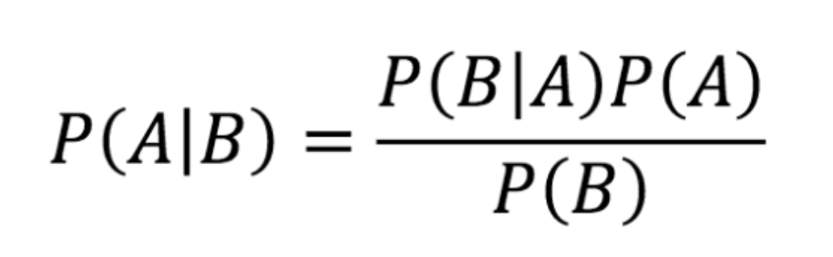
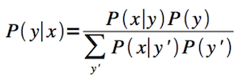

<h1 align="center">IAML Notes</h1>

By

<h3 align="center">George Karabassis with classmates</h1>

### Mathematical Preliminaries

### Naive Bayse

Bayes Rule

When P(B) is missing, use Bayes Normalizer

### Decision Trees

### Generalisation and Evaluation

### Linear Regression

### Logistic Regression

### Optimisation and Regularisation

### Support Vector Machines I & II

### Ethics and ML

### Nearest Neighbours

### K-Means

### Gaussian Mixture Models

### Principal Components Analysis

### Hierarchical Clustering

### Perceptrons, Neural Networks
